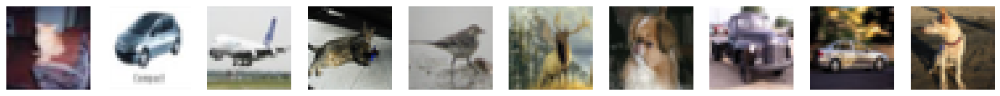
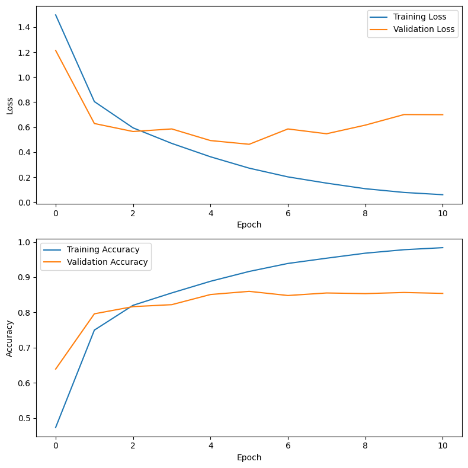
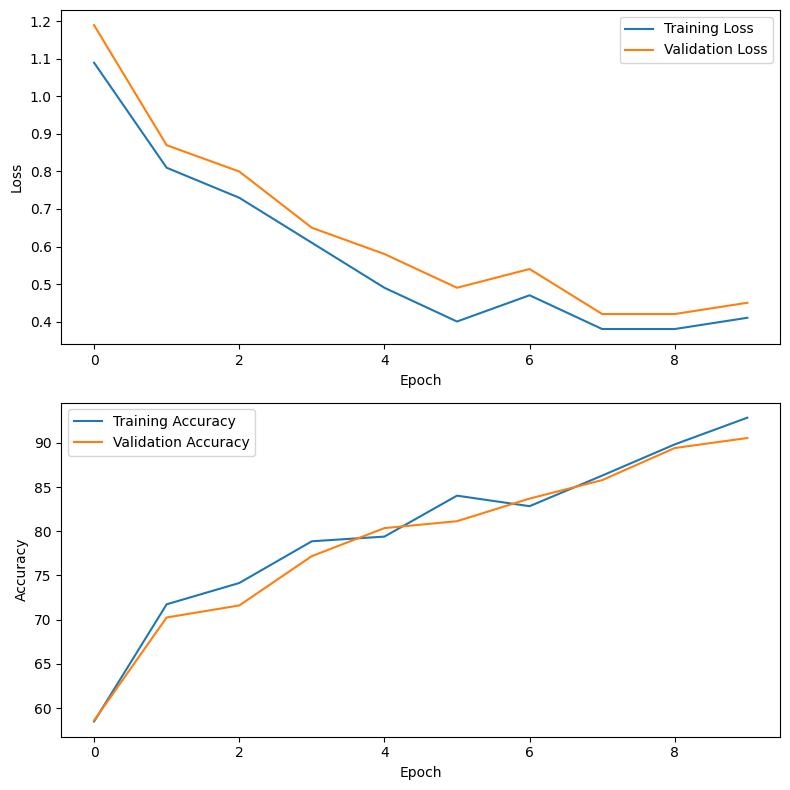
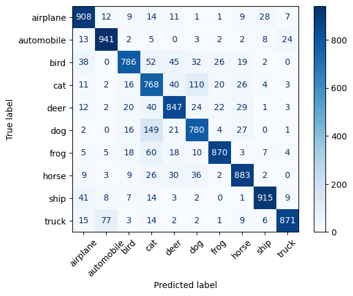
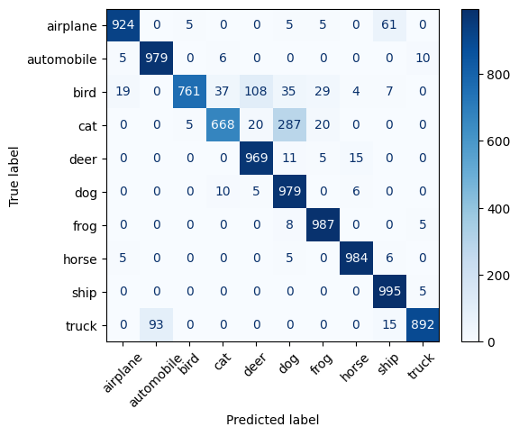

# Fine-Tuning-Transformers-CIFAR-10

## Introduction

In this notebook, we will use the `transformers` library to fine-tune a pre-trained transformer model for image classification. We will use the `ViT` model, which is a transformer model that was designed for image classification tasks. We will fine-tune the model on the `CIFAR-10` dataset, which is a dataset of 60,000 32x32 color images in 10 classes, with 6,000 images per class. The dataset is divided into 50,000 training images and 10,000 testing images.  

`ViT` is a transformer model that was designed for image classification tasks. It works by dividing an image into patches, and then processing each patch with a transformer encoder. The model then uses a classification head to predict the class of the image. The model is pre-trained on the `ImageNet` dataset, which is a large dataset of natural images.  

The architecture of the `ViT` model is as follows:

1. Input Embeddings: The input to the model is an image, which is divided into patches. Each patch is then linearly embedded to the same dimension as the model's hidden dimension. The formula for the number of patches are as follows:
2. Positional Embeddings: The model uses learnable positional embeddings to encode the position of each patch in the image.
3. Transformer Encoder: The model uses a transformer encoder to process the patches. The encoder consists of multiple layers which are:
    - Multi-Head Self-Attention: The model uses multi-head self-attention to capture the relationships between different patches in the image.
    - Feed-Forward Neural Network: The model uses a feed-forward neural network to process the output of the self-attention layer.
    - Residual Connection: The model uses residual connections around each sub-layer, followed by layer normalization.
4. Classification Head: The model uses a classification head to predict the class of the image.

The formula for different blocks are as follows:

1. Embedding Block: The embedding block consists of a linear layer to embed the patches, followed by a positional embedding layer.
    - `x = patch_embeddings(x) + position_embeddings`
    - `patch_embeddings`: Linear layer to embed the patches
      - $PE_{(patch, i)} = xW_{patch} + b_{patch}$
    - `position_embeddings`: Positional embeddings to encode the position of each patch
      - $PE_{(pos, 2i)} = sin(pos / 10000^{2i / d_{model}})$

2. Transformer Encoder Block: The transformer encoder block consists of a multi-head self-attention layer, followed by a feed-forward neural network.
    - `self_attention`: Multi-head self-attention layer
      - $softmax(\frac{QK^T}{\sqrt{d_k}})V = Attention(Q, K, V)$
      - $concat(head_1, head_2, ..., head_n)W^O = MultiHead(Q, K, V)$
    - `feed_forward`: Feed-forward neural network
      - $FFN(x) = max(0, xW_1 + b_1)W_2 + b_2$
      - `W_1`, `b_1`: Weight and bias of the first linear layer
    - `LayerNorm(x)`: Layer normalization
      - $LayerNorm(x) = \frac{x - \mu}{\sqrt{\sigma^2 + \epsilon}}$
    - `Residual(x, y)`: Residual connection
      - $Residual(x, y) = x + y$

[This paper](https://openaccess.thecvf.com/content/ICCV2023/papers/Xu_FDViT_Improve_the_Hierarchical_Architecture_of_Vision_Transformer_ICCV_2023_paper.pdf) proposes a novel hierarchical architecture for vision transformers called FDViT to address the challenge of high computational costs in vision transformers. The key ideas are:

1. Introducing a flexible downsampling (FD) layer that is not limited to integer stride, allowing for smooth reduction of spatial dimensions to avoid excessive information loss.
2. Using a masked auto-encoder architecture to facilitate the training of the FD layers and generate informative outputs.
The proposed FDViT achieves better classification performance with fewer FLOPs and parameters compared to existing hierarchical vision transformer models. Experiments on ImageNet, COCO, and ADE20K datasets demonstrate the effectiveness of the method.

Also [this paper](https://research.google/blog/improving-vision-transformer-efficiency-and-accuracy-by-learning-to-tokenize/) discusses a module called TokenLearner that can be used to improve the efficiency and accuracy of Vision Transformer (ViT) models. TokenLearner is a learnable module that generates a smaller set of adaptive tokens from the input image or video, rather than using a fixed, uniform tokenization. This reduces the number of tokens that need to be processed by the subsequent Transformer layers, leading to significant savings in memory and computation without compromising performance. The document presents experiments showing that inserting TokenLearner at different locations within a ViT model can achieve comparable or better accuracy than the baseline ViT, while reducing the computational cost by up to two-thirds. TokenLearner is particularly effective for video understanding tasks, where it achieves state-of-the-art performance on several benchmarks.

## Dataset

The `CIFAR-10` dataset is a dataset of 60,000 32x32 color images in 10 classes, with 6,000 images per class. The dataset is divided into 50,000 training images and 10,000 testing images. The dataset is widely used in computer vision tasks, such as image classification, object detection, and image segmentation. The dataset is also used in the ImageNet dataset, which is a large dataset of natural images.

## Models

### CNN

We used the famous `VGG19` model from `keras`, using the pre-trained `imagenet1k` weights. We freeze all layers before the `block5_conv1` layer and train the rest of the model on CIFAR-10, we also used `DenseNet121` model as well which source can be found in `src` folder.

[Source Code](https://github.com/fchollet/deep-learning-models/blob/master/vgg19.py)

### Transformer

We used the `DeiTBaseDistilled` model from `transformers` library, using the pre-trained `imagenet1k` weights. We freeze the first 11 blocks and train the rest of the model on CIFAR-10.

[Source Code](https://huggingface.co/docs/transformers/en/model_doc/deit)

## Results

The results of this classification experiment are shown below.

### Loss and Accuracy

The loss and accuracy plot for both the CNN and Transformer models are as follows:

#### VGG19

#### DeIT

### Classification Report

#### VGG19

| Class       | Precision | Recall | F1-Score | Support |
|-------------|-----------|--------|----------|---------|
| airplane    | 0.89      | 0.88   | 0.89     | 1000    |
| automobile  | 0.92      | 0.93   | 0.93     | 1000    |
| bird        | 0.84      | 0.82   | 0.83     | 1000    |
| cat         | 0.71      | 0.73   | 0.72     | 1000    |
| deer        | 0.83      | 0.84   | 0.83     | 1000    |
| dog         | 0.81      | 0.75   | 0.78     | 1000    |
| frog        | 0.89      | 0.90   | 0.89     | 1000    |
| horse       | 0.87      | 0.89   | 0.88     | 1000    |
| ship        | 0.92      | 0.93   | 0.93     | 1000    |
| truck       | 0.91      | 0.91   | 0.91     | 1000    |
| **accuracy**|           |        | 0.86     | 10000   |
| **macro avg**| 0.86     | 0.86   | 0.86     | 10000   |
| **weighted avg**| 0.86  | 0.86   | 0.86     | 10000   |

#### DeIT

| Class       | Precision | Recall | F1-Score | Support |
|-------------|-----------|--------|----------|---------|
| airplane    | 0.97      | 0.92   | 0.95     | 1000    |
| automobile  | 0.91      | 0.98   | 0.94     | 1000    |
| bird        | 0.99      | 0.76   | 0.86     | 1000    |
| cat         | 0.93      | 0.67   | 0.78     | 1000    |
| deer        | 0.88      | 0.97   | 0.92     | 1000    |
| dog         | 0.74      | 0.98   | 0.84     | 1000    |
| frog        | 0.94      | 0.99   | 0.96     | 1000    |
| horse       | 0.98      | 0.98   | 0.98     | 1000    |
| ship        | 0.92      | 0.99   | 0.95     | 1000    |
| truck       | 0.98      | 0.89   | 0.93     | 1000    |
| **accuracy**|           |        | 0.91     | 10000   |
| **macro avg**| 0.92     | 0.91   | 0.91     | 10000   |
| **weighted avg**| 0.92  | 0.91   | 0.91     | 10000   |

### Confusion Matrix

#### VGG19

#### DeIT

## Conclusion

Now we will compare the models. Note that the `DenseNet201` model (which is a type of CNN) was also trained, and you can see the results in the code.

Based on the Classification Report, it can be concluded that both models are classifying with good accuracy. The accuracy of the CNN model was about 86%, and the accuracy of the Transformer model was about 91%, indicating that the Transformer model, despite having fewer trainable parameters (though it had many more parameters overall), has better accuracy and performance. This hypothesis can also be confirmed by examining the F1 and Recall scores. By examining the confusion matrixes, it can be seen that the transformer model, except for the bird and cat classes (which were confused with deer and dog, respectively) and the truck class (which was somewhat confused with automobile), has very good accuracy for the other classes and can almost completely identify them. The CNN model also had issues in these areas, but overall, it performed poorly in classifying birds and misidentified some other images. The accuracy and loss charts and other parameters also show the superiority of the transformer model, although the CNN model also has acceptable accuracy.

The transformer model, although it has better accuracy, took much more time (about 7 times more) for each training session and was also much heavier, consuming more memory and GPU resources (although different libraries were used, and the system conditions were not entirely identical, so the results are not precisely comparable, but a general view of the ratio and comparison of the two can be obtained). The test time for both was somewhat close (although the transformer's was longer, which is logical given the fourfold number of parameters), and probably the time differences would be greater if we were to repeat the experiment.

An important point in comparing the performance of these two models is that the CNN model has a bit of overfitting, although transformer models are generally more vulnerable to this issue. However, as mentioned, due to system limitations, it was not possible to train the model further, but if continued, the model would probably overfit a bit. As a solution, we could have used methods like regularization, which was not used here to keep the conditions identical, although early stopping was used for the CNN model to prevent severe overfitting.

## Contributors

- [Matin Bazrafshan](https://github.com/FabulousMatin)
- [Shahriar Attar](https://github.com/Shahriar-0)